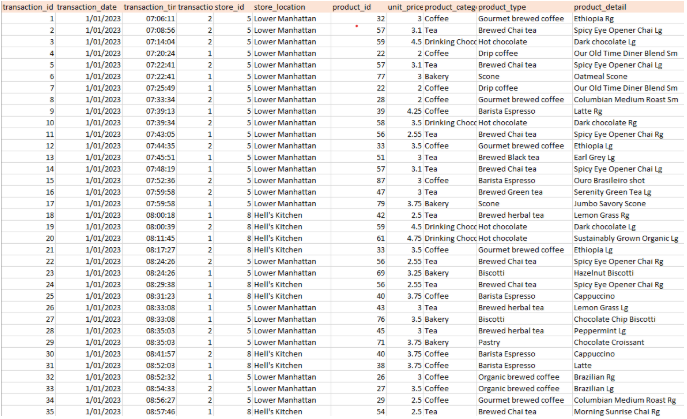
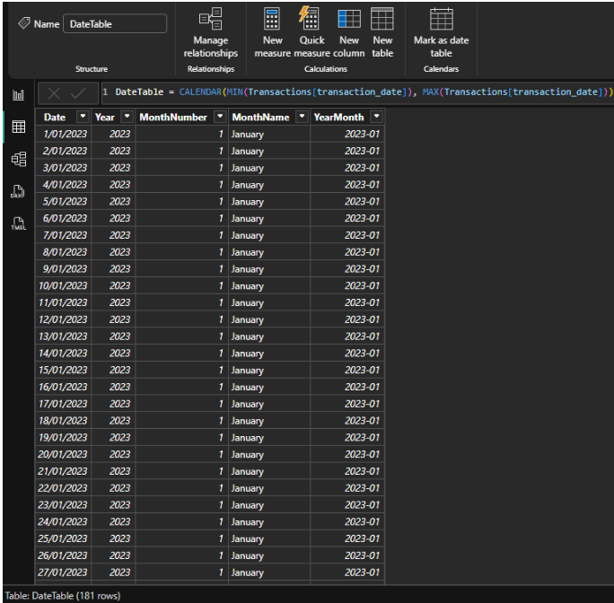
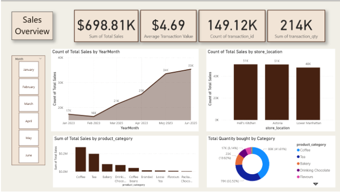
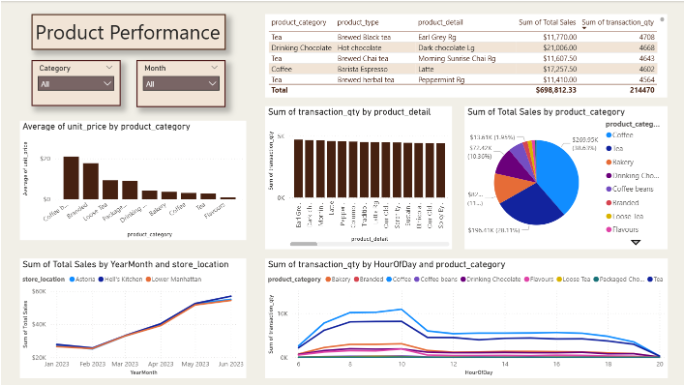
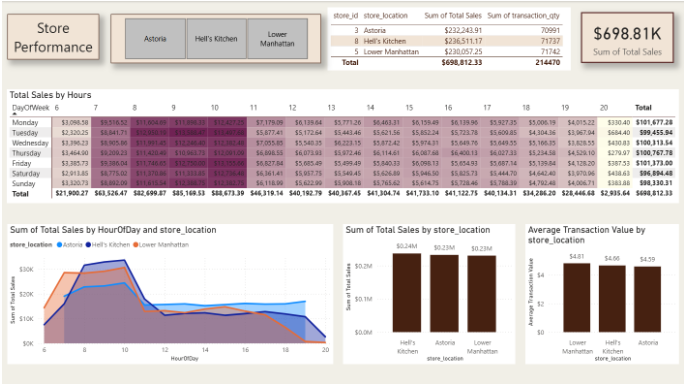

## Project Overview

This dataset was taken from Maven Analytics website.

### Power Query

The initial data cleaning process was done in Power Query. Data type of transaction_time was changed to "Time" and an extra column to calculate the total price was created by multiplying quantity and unit_price. The cleaned dataset contains 149,117 rows and 12 columns.

### DAX measures

The new table was created called DateTable. This included five columns:

- Date: DateTable = CALENDAR(MIN(coffee_shop\[transaction_date\]), MAX(coffee_shop\[transaction_date\]))
- Year = YEAR(DateTable\[Date\])
- Month Number = MONTH(DateTable\[Date\])
- Month Name = FORMAT(DateTable\[Date\], "MMMM")
- YearMonth = FORMAT(DateTable\[Date\], "YYYY-MM")

Another three columns were also added to the existing Coffee Shop dataset.

- HourOfDay = HOUR(coffee_shop\[transaction_time\])
- DayOfWeek = FORMAT(coffee_shop\[transaction_date\], "dddd")
- DayOfWeekNumber = WEEKDAY(coffee_shop\[transaction_date\], 2)

These DAX measures were created to transform the transaction dates and times into meaningful time dimensions, which were then used to build the summary visualisations in the dashboard.

## Sales Overview- Page One

This Power BI dashboard presents a dynamic overview of sales performance for a coffee shop chain over six months. The goal of this report was to provide clear, data-driven insights into overall revenue trends, product performance, and customer purchasing patterns.

#### Key Metrics and Insights

- Transactions: 14,912,000 individual transactions, representing 214K total items sold.

- Sales Trend: The line and area chart shows a strong upward trend in sales — starting at 17K in January and reaching 35K in June, indicating consistent growth and possibly successful seasonal promotions.

- Location Performance: The bar chart compares total sales across three branches — Hell’s Kitchen and Astoria lead with 51K sales each, while Lower Manhattan follows closely with 48K.

- Category Analysis: The bar chart shows Coffee generated the highest sales as well as the donut chart revealing that Coffee accounts for 41.6% of total items sold, highlighting it as the dominant revenue driver.

#### Interactivity and Design

- Month Filter: Allows users to explore sales trends by specific months to identify seasonal patterns or promotional impacts.

- Clean, Neutral Theme: The dashboard uses warm beige and brown tones to align with the coffee-shop aesthetic.

- User-Friendly Layout: Key metrics are displayed prominently at the top, with supporting visuals arranged logically for a quick, intuitive analysis experience.

### Product Performance - Page Two

Page two focuses on analyzing product-level performance across different categories, locations, and time periods. The dashboard provides a detailed view of sales distribution, unit pricing, and customer purchasing patterns, helping the coffee shop identify its most profitable and popular products.

Interactive slicers for Category and Month allow users to dynamically filter data and uncover trends by specific product category or time frames.

#### Key Metrics and Insights

- Total Sales: \$698.81K generated across all product categories.
- Total Quantity Sold: 214,470 items, covering beverages and related products such as tea, coffee beans, and bakery items.
- Sales by Product Category: Coffee leads with \$269.95K (38.63%), followed by Tea (\$196.41K, 28.11%) and Bakery products (\$82.4K, 11.8%), as shown in the pie chart.
- Top-selling products: Top-selling products include Earl Grey Tea, Dark Chocolate Hot Chocolate, and Latte, each contributing over 4,500 units sold.
- Sales by Month and Location: All three store locations - Astoria, Hell’s Kitchen, and Lower Manhattan - show a consistent upward sales trend, peaking around June 2023.
- Sales by Hour of Day: Transaction quantities peak between 8–10 AM, indicating strong morning demand, particularly for coffee-based beverages and bakery items.

#### Interactivity and Design

- Intuitive Layout: Tables and charts are grouped logically - from pricing and quantity metrics to temporal and categorical trends.
- Interactive Exploration: Filters and drilldowns enable users to focus on specific categories or products with ease.

### Store Performance - Page Three

The last page visualises sales performance across the three stores, helping management identify top-performing stores, sales performance by hour and transaction efficiency.

#### Key Metrics and Insights

- Total Sales Overview: The company achieved a total of \$698.81K in sales across all stores, with relatively even performance among the three locations.
- Hourly Sales Trends: Sales peak between 9 AM and 1 PM, showing that most customer activity happens in the late morning. After 2 PM, sales drop significantly, suggesting an opportunity to optimize staffing or promotions during slower hours.
- Average Transaction Value: The highest average transaction value was at Lower Manhattan (\$4.81), followed by Hell’s Kitchen (\$4.66) and Astoria (\$4.59). This suggests that although Hell’s Kitchen sells more overall, customers at Lower Manhattan spend slightly more per transaction. Interactivity and Design Slicers:Used slicers for store location filtering. Conditional Formatting:Applied conditional formatting in the heatmap to highlight sales peaks by hour.

#### Interactivity and Design

- Slicers:Used slicers for store location filtering.
- Conditional Formatting: Applied conditional formatting in the heatmap to highlight sales peaks by hour.
